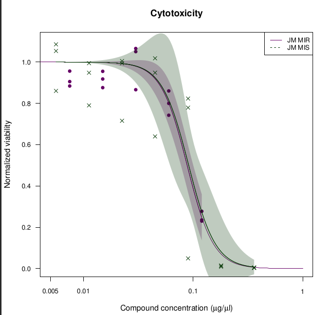
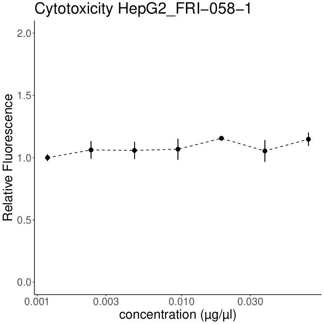
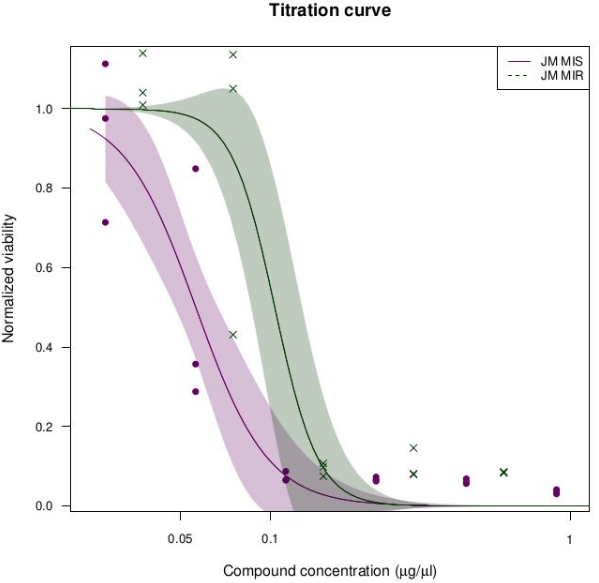

# Antimicrobial analysis

Set of scripts for analysing antimicrobial activity of multiple compounds. The scripts include analysis of: 

#### Synergism:

This script collects the data from the csv file obtaind from the plate reader, prepares the input data to use the  ``synergyfinder`` library and makes the interaction analysis between two compounds. 

  An example plot of percentage of inhibition

  An example plot of interaction between two compounds

--------------------------------------------------------------

#### Cytotoxicity

There are two scripts for analysing cytotoxicity. Both can collect the data from the csv file obtaind from the plate reader and prepares the input data. 
One script will let you to calculate EC50 and EC90 values and also make plots for titration curves using the ``drc`` library.

The other will let you plot all the data as mean and SD. 

--------------------------------------------------------------

#### Titration curves in bacteria (planctonic and biofilm)
The analysis is similar to the cytotoxicity, but since the data from the csv file obtaind from the plate reader is different the script prepares the input data to generate the input for the ``drc``  library.

  An example plot of a titration curve in planctonic

  An example plot of a titration curve in biofilm

--------------------------------------------------------------

#### Disruption of biofilms, etc.  
This script let you plot the disruption of a biofilm after treatment. The input data is a csv file form the plate reader. The script will collect the data and process it to calculate, mean, SD, analyse the multiple comparisons with  ``agricolae `` library and make the plots. 

  An example plot of biofilm disruption

#### Growth curves

There are four scritps to analyse growth curves. Each script uses a different model, from basic models to more complex models.

